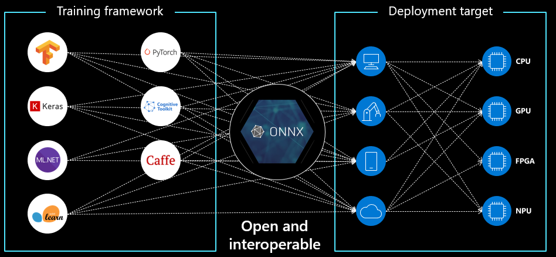
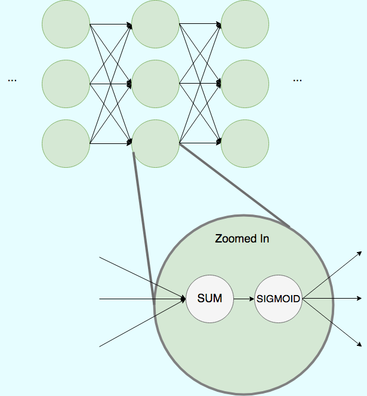

# ONNX-RS

## What is this and why it exists?

This is an experimental Deep Learning Training library based on the [ONNX spec](https://github.com/onnx/onnx) allowing to declare and train a Neural Network.

## What is ONNX
As more training frameworks began showing up (Pytorch, Tensorflow 1, Tensorflow 1, Swift for Tensorflow, PaddlePaddle, Keras,  MXnet, etc) there was a need for a unified representation of the Neural Network so inference could be accelerated on different environments and specialized hardware: CoreML for iOS/Mac, Android's NNAPI, MS WindowsML, Tensorflow lite, Nvidia's TensorRT etc.

Deep Neural Networks are usually represented as a computational graph, much like regular computer programs

Recently ONNX [gained (experimental) training support](https://github.com/onnx/onnx/blob/master/docs/IR.md#training-related-information). 

So, could we create a Deep Learning training lib in Rust and use an ONNX Runner to actually train it? Let's find out!

# Why use ONNX

This allows us to decouple the Neural Network building API from the executing running/training part and have excellent performance/GPU/TPU etc acceleration for free. Without doing the "hard work" of actually implementing the running of the network and calculating it's gradients.

# Current state

There is a quite good ONNX runner in Rust already, by Sonos: [https://github.com/sonos/tract](https://github.com/sonos/tract "https://github.com/sonos/tract") but it does not support training yet and is CPU only.

The best ONNX runtime with training support I could find so far was https://github.com/microsoft/onnxruntime but even this one does not support [Gradient operators yet](https://github.com/microsoft/onnxruntime/discussions/5892) or [training standard ONNX models, focusing on Pytorch ones](https://github.com/microsoft/onnxruntime/discussions/5969) and requires compiling from source at time of writing.  

Due to this limitations, this PoC repo is... rough to say the least:
-   The ONNX representation is written to a file along with it's inputs 
-   A Python script is called from Rust which runs the ONNX and outputs (to stdout) the loss and updated weights.
-   The ONNX model in Rust is updated with the new weights  

The Python imports alone take around ~1s to load, which make it super slow.  
